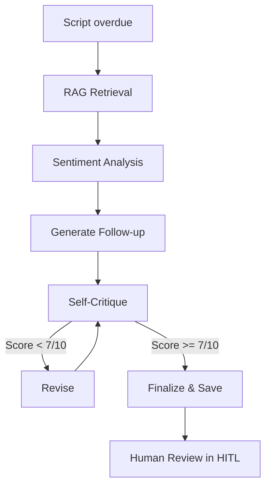

# Greenlit

Solving the content approval loop problem for content agencies.

**Live:** [greenlit.ruskaruma.me](https://greenlit.ruskaruma.me)

---

## What it does

Content agencies send scripts to clients for approval. Clients ghost. Scripts sit in limbo. Deadlines slip.

Greenlit fixes this. Upload a script, send it for review, and an AI agent automatically follows up with personalized chasers until the client responds. No manual chasing. No dropped balls.

- **Onboard clients** with a step-by-step wizard — welcome email, WhatsApp notification, and AI memory seeding happen automatically
- **Send scripts for review** via email or WhatsApp — clients approve, reject, or request changes with one click
- **AI agent writes follow-ups** when clients don't respond — tone-aware, context-aware, personalized
- **Human-in-the-loop** — every AI-generated chaser goes through you before it reaches the client
- **Reports & analytics** — multi-platform performance reports with AI-generated summaries, sent directly to clients
- **Daily digest** — morning summary of what needs attention, what's overdue, and what got approved

---

## How the agent works

The agent kicks in when a client hasn't responded to a script. It doesn't just send a generic reminder — it builds context, picks the right tone, writes a draft, critiques its own work, and revises if needed.

**Step by step:**

1. **RAG Retrieval** — pulls client memories and past interactions from vector search to understand who this client is
2. **Sentiment Analysis** — looks at how overdue the script is and the client's history to pick a tone (gentle, neutral, firm, urgent)
3. **Generate** — writes a personalized follow-up email using all that context
4. **Self-Critique** — scores the draft on professionalism, personalization, clarity, and persuasiveness
5. **Revise** — if the score is below 7/10, rewrites based on its own feedback (up to 2 times)
6. **Finalize** — saves the polished draft for you to review, edit, and send

Nothing reaches the client without your approval.

---

## Tech stack

- **Language:** TypeScript
- **Framework:** Next.js (App Router)
- **AI agent:** LangGraph + LangChain
- **LLM:** Claude (Anthropic)
- **Database:** Supabase (PostgreSQL + pgvector for embeddings)
- **Email:** Resend
- **WhatsApp:** Twilio
- **Hosting:** Vercel

---

Built by [ruskaruma](https://github.com/ruskaruma)
